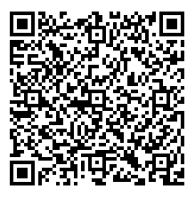

# Dreamin Partners salesforce application

## What is this application?

This is a salesforce applicaiton that Dreamin Event organizers can propose to their partners while experiencing an event.

## How my partners can use it?

- Step 1:
  - Make sure Lead is private OWD, and it has no Validation Rule or Trigger that could prevent from creating leads with only name, phone, company and email information.
  - Then install the application in your org.
- Step 2:
  - Create access to your org for your partners
- Step 3:
  - Assign your partner the Permission Set included in this package (so they can see and use the application).
  - Note that this step will grand read and create access to Lead for your partners as well.
- Step 4:
  - Have partners install the Salesforce mobile app on their phone or tablet
  - Make them authenticate to your org via the mobile app.
- Step 5:
  - The application is called "Dreamin Partners", on the home page of this app.
  - As of now, the only service that we provide is to scan visitors' QRCodes to generate leads for partners.

## How do I pass visitors information to the applicaiton

- When you print the QRCode in the visitors' badges, make sure the information in the QRCode is using this template:
```
{ 
    "name": { 
        "firstname": "James", 
        "lastname": "BOND"
    }, 
    "company": "MI6", 
    "email": "james@bond.com",
    "phone": "+44 (0)12 345 6789"
}
```
- The `name` property is mandatory with at least two propeties `firstname` and `lastname`. Any other properties are optional.
- Below is an example of such QRCode:



## How do I pass visitors information to the partners afterwards?

- The application creates Lead records when scanning and the owner of such records will be the partner's user.
- So typically a report filtered by user or company's users should be fine.
